# Diagram Alur — Website Masjid Al-Kahfi

Dokumen ini berisi seluruh diagram alur (flow) aplikasi Website Profil Masjid Al-Kahfi menggunakan **Mermaid**. Diagram dapat dirender langsung di GitHub/GitLab, VS Code (extension Mermaid), atau layanan seperti [mermaid.live](https://mermaid.live).

## Daftar Isi

1. [Arsitektur Sistem (High-Level)](#1-arsitektur-sistem-high-level)
2. [Lifecycle Request & Routing](#2-lifecycle-request--routing)
3. [Peta Situs (Sitemap Flow)](#3-peta-situs-sitemap-flow)
4. [Alur Autentikasi & Otorisasi](#4-alur-autentikasi--otorisasi)
5. [Alur Guard Route Terproteksi](#5-alur-guard-route-terproteksi)
6. [Alur CRUD Admin (Generic)](#6-alur-crud-admin-generic)
7. [Alur Pembuatan Berita (lengkap)](#7-alur-pembuatan-berita-lengkap)
8. [Alur Upload Gambar](#8-alur-upload-gambar)
9. [Alur Audit Trail (createdBy/updatedBy)](#9-alur-audit-trail-createdbyupdatedby)
10. [Alur Jadwal Sholat](#10-alur-jadwal-sholat)
11. [Alur Dashboard (Statistik & Aktivitas)](#11-alur-dashboard-statistik--aktivitas)
12. [ERD — Schema Database](#12-erd--schema-database)

---

## 1. Arsitektur Sistem (High-Level)

Gambaran komponen utama dan arah data.

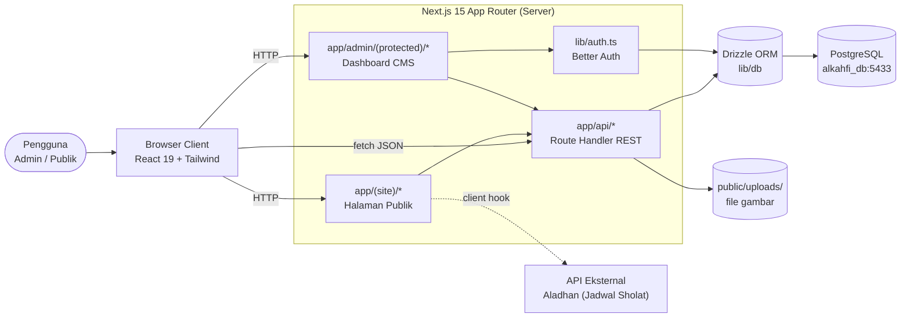

---

## 2. Lifecycle Request & Routing

Bagaimana Next.js App Router mengarahkan request berdasarkan route group `(site)` vs `admin/(protected)`.

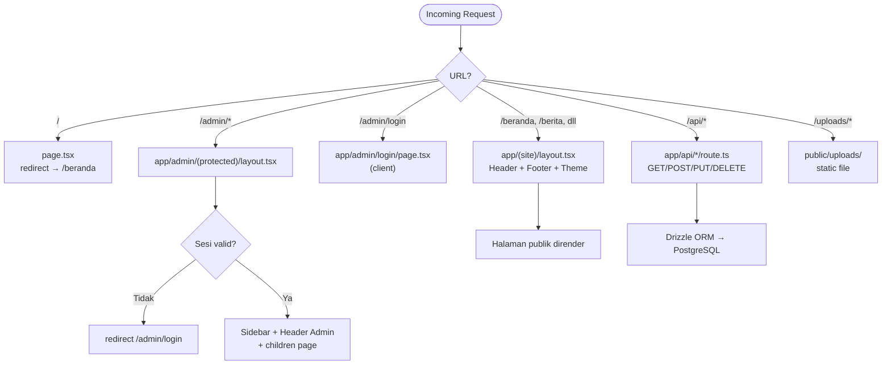

---

## 3. Peta Situs (Sitemap Flow)

Navigasi antar halaman publik dan pintu masuk ke area admin.

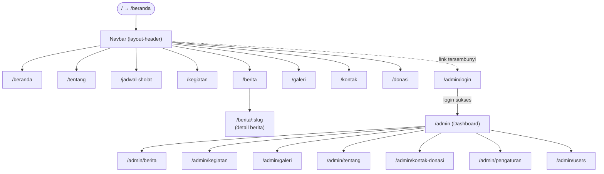

---

## 4. Alur Autentikasi & Otorisasi

Login admin memakai Better Auth (email + password, bcrypt).

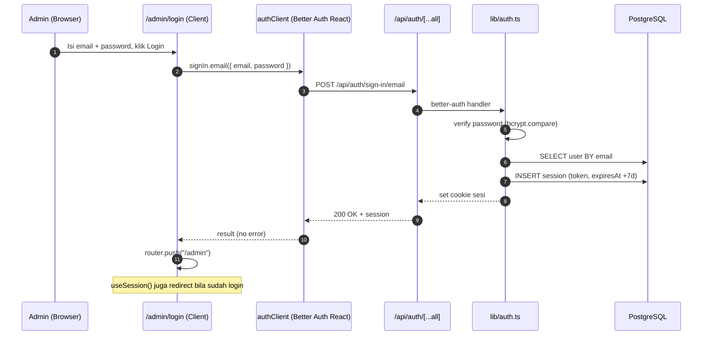

---

## 5. Alur Guard Route Terproteksi

Verifikasi sesi **server-side** di `app/admin/(protected)/layout.tsx` sebelum halaman dirender.

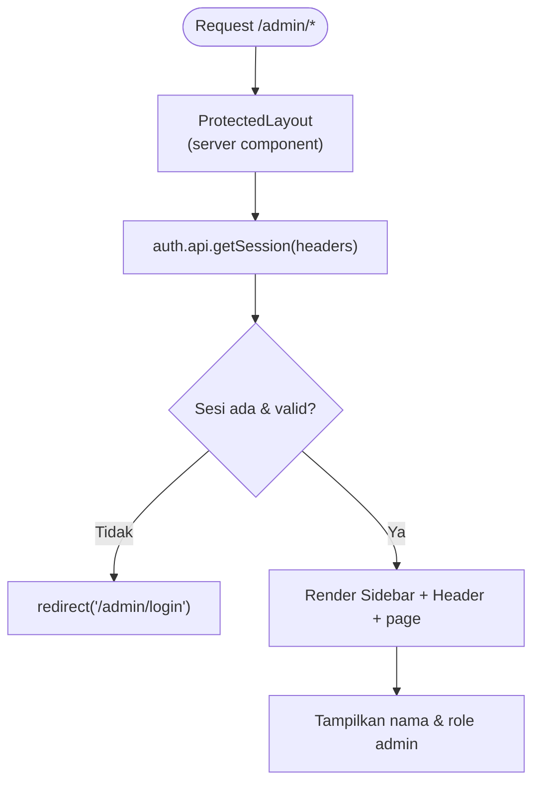

---

## 6. Alur CRUD Admin (Generic)

Pola yang sama berlaku untuk berita, kegiatan, galeri, pengurus, fasilitas, users.

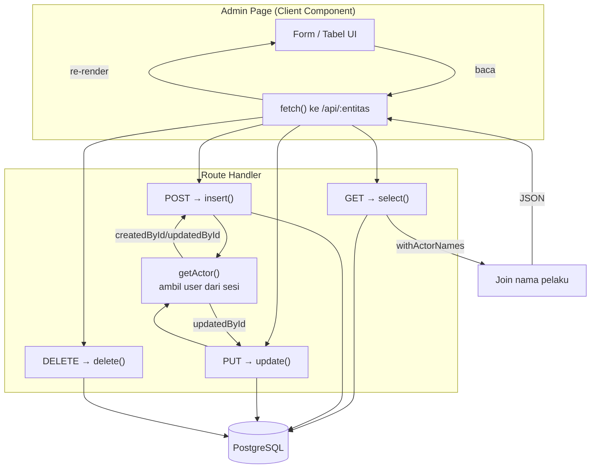

---

## 7. Alur Pembuatan Berita (lengkap)

Flow paling kompleks: rich text editor, upload gambar, auto-slug unik.

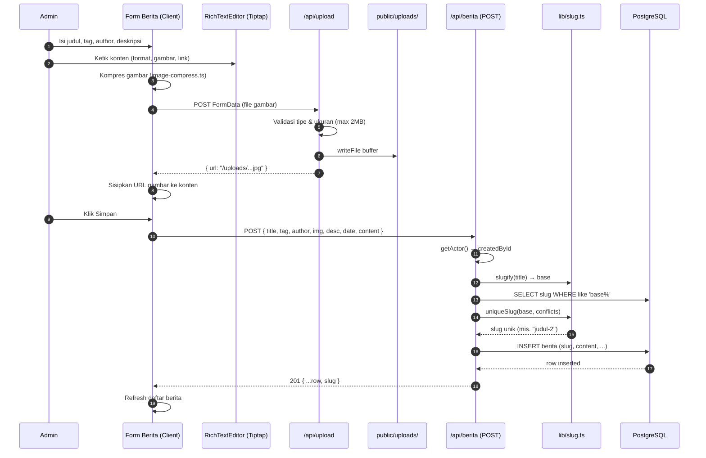

---

## 8. Alur Upload Gambar

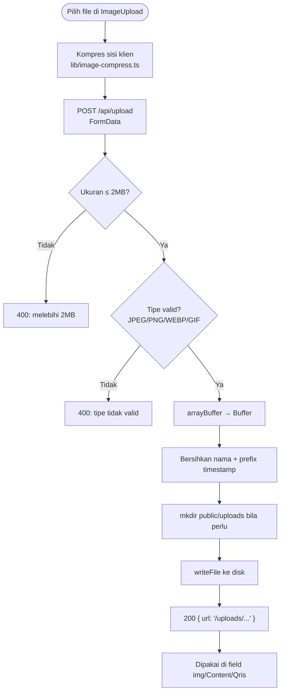

---

## 9. Alur Audit Trail (createdBy/updatedBy)

Bagaimana setiap entitas konten melaporkan siapa pembuat/pengubah.

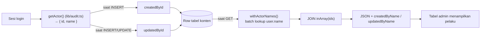

---

## 10. Alur Jadwal Sholat

Jadwal harian berbasis koordinat masjid via API Aladhan (metode Kemenag RI), dengan cache & fallback.

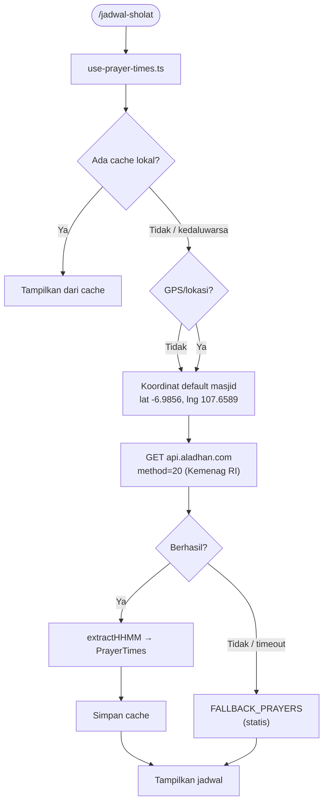

---

## 11. Alur Dashboard (Statistik & Aktivitas)

Dashboard admin memuat ringkasan jumlah entitas dan aktivitas terbaru.

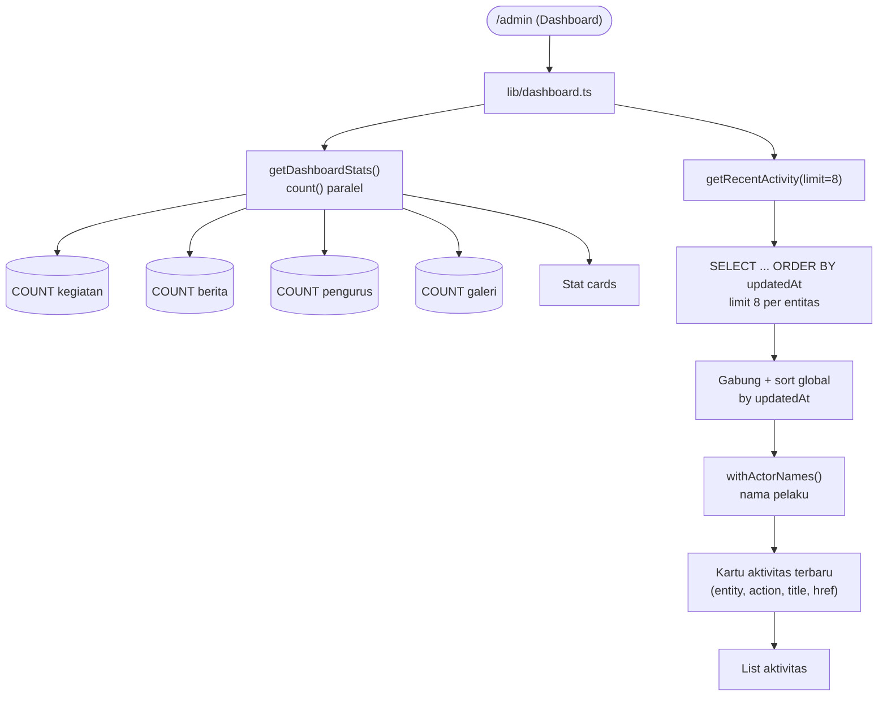

---

## 12. ERD — Schema Database

Relasi seluruh tabel di `lib/db/schema.ts`.

```mermaid
erDiagram
    USER ||--o{ SESSION : has
    USER ||--o{ ACCOUNT : has
    USER ||--o{ BERITA : "createdBy/updatedBy"
    USER ||--o{ KEGIATAN : "createdBy/updatedBy"
    USER ||--o{ GALERI : "createdBy/updatedBy"
    USER ||--o{ PENGURUS : "createdBy/updatedBy"
    USER ||--o{ PROFIL_MASJID : "createdBy/updatedBy"
    USER ||--o{ FASILITAS : "createdBy/updatedBy"
    USER ||--o{ KONTAK : "createdBy/updatedBy"
    USER ||--o{ DONASI : "createdBy/updatedBy"
    USER ||--o{ PENGATURAN : "createdBy/updatedBy"

    USER {
        text id PK
        text email UK
        text password
        text name
        text image
        enum role "superadmin|admin"
        bool email_verified
        timestamp created_at
        timestamp updated_at
    }
    SESSION {
        text id PK
        text token UK
        timestamp expires_at
        text user_id FK
        text ip_address
        text user_agent
    }
    ACCOUNT {
        text id PK
        text account_id
        text provider_id
        text user_id FK
        text access_token
        text refresh_token
        text password
    }
    VERIFICATION {
        text id PK
        text identifier
        text value
        timestamp expires_at
    }

    BERITA {
        serial id PK
        text title
        text tag
        text author
        text date
        text img
        text desc
        text content
        text slug
        text created_by_id FK
        text updated_by_id FK
    }
    KEGIATAN {
        serial id PK
        text title
        text type "Harian|Jumat|HariBesar"
        text time
        text ust
        text status "Aktif|Nonaktif"
        boolean featured
        text created_by_id FK
    }
    GALERI {
        serial id PK
        text title
        text img
        text created_by_id FK
    }
    PENGURUS {
        serial id PK
        text nama
        text foto
        enum tingkat "pembina|penasehat|pimpinan|idarah|imarah|riayah"
        text sub_bidang
        text jabatan
        integer urutan
        text periode
    }
    PROFIL_MASJID {
        serial id PK
        text visi
        text misi
        text history
    }
    FASILITAS {
        serial id PK
        text title
        text desc
        text icon
    }
    KONTAK {
        serial id PK
        text alamat
        text hotline
        text email
        text jam_operasional
        text google_maps_url
    }
    DONASI {
        serial id PK
        text nama_rekening
        text nomor_rekening
        text atas_nama_rekening
        text qris_image
    }
    PENGATURAN {
        text key PK
        text value
    }
```

---

## Catatan

- Semua diagram dibuat mengacu pada kode aktual di repository (`lib/auth.ts`, `lib/audit.ts`, `lib/dashboard.ts`, `lib/prayer-times.ts`, `lib/db/schema.ts`, dan `app/api/*/route.ts`).
- Untuk merender: GitHub merender blok ```` ```mermaid ```` secara otomatis; atau salin ke [mermaid.live](https://mermaid.live).
- Bila ada perubahan arsitektur, perbarui diagram ini bersamaan dengan perubahan kode agar tetap akurat.
